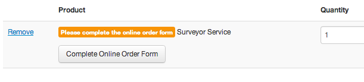

# External Services — Order Forms

Services can require a completed order form which can be hosted through an external service. By default, NUCore uses Surveyor as its external service, but it should be simple to integrate another service.

Currently, you can only use one external service at a time.

## Default (and only): UrlService

You can change the default external service by creating a new class that extends from [`ExternalService`](../app/models/external_service.rb) and changing the value of external_services.survey in settings.yml. The current implementation, [`UrlService`](../app/models/url_service.rb), provides the majority of functionality.

## Process

1. Add the URL to the product under Products > Services > Order Forms and activate the form. This should be the URL for taking a new survey

    For Surveyor, this link is `http://[yourdomain.com]/surveys/[survey-path]`

2. User adds the service to their cart
   
   
   
3. The "Complete Online Order Form" button links (via GET) to the URL added to the product. It also includes the following parameters:

   `success_url` The URL that the external service should redirect to upon completion of the survey.
    e.g. `http://[yourdomain.com]/facilities/[facility_url]/services/[service_url]/surveys/[external_service_id]/complete?receiver_id=[order_detail_id]`
   
   `receiver_id` The OrderDetail ID

4. Once the user completes the survey, the external service should redirect the user to `success_url`. The URL should have the following additional parameters:

   `receiver_id` Was passed to the external service
   
   `survey_url` This is the URL to view the completed survey.

5. The user may go and edit their order form
    
    
    
    The link to this will be the `survey_url` passed back unless you have overridden `edit_url` in a subclass of `UrlService`. For example, Surveyor appends "/take" to the end of the URL for editing.

6. Once the user has purchased the product, administrators will see a link to "View Order Form" under the order. This links to the `survey_url` that was passed back. 

## Developer Notes

Your new service must extend from `ExternalService` and contain the following methods. `receiver` in this case will be the OrderDetail object.

`new_url(receiver)` Returns the URL for filling out a new survey. This URL should contain the `success_url` parameter for where the external service should return after the user completes the survey. The main part of the URL will likely be the `location` field from the database.

`edit_url(receiver)` Returns the URL for editing a completed survey

`show_url(receiver)` Used on the administrative side to link to viewing a completed survey

The easiest way to set up an external service is to extend the `UrlService` class, which contains basic functionality for these three methods. The `Surveyor` class does this.

   
